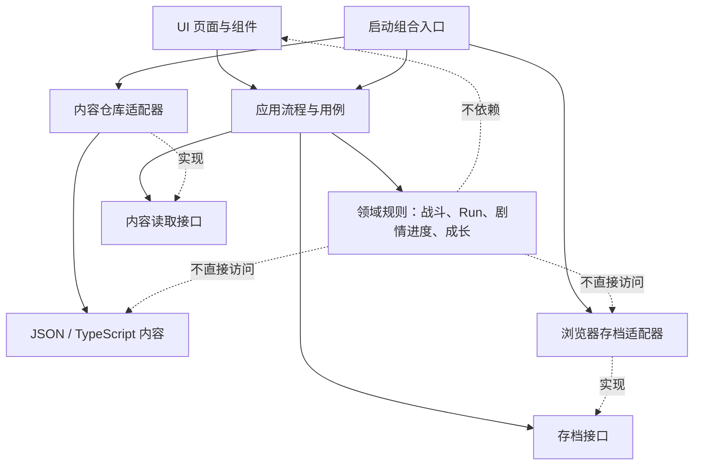

# 《渡魂》架构与内容生产规范 v1

**版本：** 1.0
**日期：** 2026-09-25
**状态：** 项目决策基线；新增系统按此执行，既有稳定系统按风险渐进迁移。
**适用工程：** 当前 TypeScript + Vite + DOM/CSS 项目。

本文是工程与内容生产规范，不是要求立即重写工程。目标是让新增章节、摆渡人、卡牌、信物、剧情和成长系统能够持续扩充，同时保持战斗可测试、存档可升级、UI可跨分辨率维护。

“商业化架构”在本文中指**具备持续迭代、内容校验、兼容升级和发布回归能力的工程基线**，不代表仅靠架构即可保证产品商业成功。架构应服务当前小团队和产品，而不是照搬大型项目的工具链。

## 1. 研究结论与项目取舍

本规范参考了成熟卡牌 Roguelike 的开发经验和引擎官方数据组织指南。借鉴的是原则，不是某款游戏的具体玩法或引擎实现。

| 资料 | 可验证的经验 | 《渡魂》的采用方式 |
|---|---|---|
| Mega Crit 在 GDC 分享《Slay the Spire》的平衡设计 | 开发团队在持续迭代中采用数据驱动方式，同时结合社区反馈、游戏手感与难度观察。 | 卡牌、敌魂、Intent、奖励与章节难度必须可追溯、可校验、可复测；平衡记录需保存版本、种子和战斗配置。数据用于发现问题，不能替代叙事和手感判断。[1] |
| Mega Crit 的 GDC 开发分享 | Early Access 期间持续更新，包含修复缺陷、重做卡牌、增加遗物、改善用户体验、本地化和硬件兼容。 | 内容更新本身必须有校验、自动回归、视口检查和发布清单；模块边界应让局部内容调整不轻易破坏已验收流程。[2] |
| Unity 官方数据与逻辑分离指南 | 静态游戏数据适合与行为逻辑分离，但架构模式需要按团队和项目取舍。 | 采用“静态定义与运行状态分开”的原则；不引入 Unity ScriptableObject，也不为尚不存在的编辑团队搭建复杂编辑器。[3] |
| Godot 官方 Resource 文档 | 可编辑、可序列化的数据资源能减少内容和运行对象之间的耦合；数据形式应服务编辑与版本管理。 | 当前继续使用 JSON/TypeScript 内容文件，补充 schema、引用校验和资产校验；等内容量或协作者需求证明必要时再考虑编辑器。[4] |

这些资料支持的核心结论是：**让内容容易调整、错误尽早暴露、每次更新都可验证**。它们并不能证明某个文件夹结构、事件总线或 ECS 是商业项目的必选项，因此本项目暂不引入这些复杂度。

## 2. 工程现状盘点

当前工程已有 `src/core`、`src/data`、`src/ui` 的基本边界，并有战斗、Run、主菜单、序章、驿站和多视口测试。它已经具备可迭代原型的基础，不需要推倒重来。

| 现状 | 可能的后续问题 | v1处理决定 |
|---|---|---|
| `src/core/types.ts` 集中定义卡牌、人物、魂、战斗等类型。 | 新增系统时容易形成共享大类型文件和跨系统改动。 | 不一次性拆分；新系统类型放在所属模块，旧类型在触及时逐步迁出。 |
| `src/core/run.ts` 直接读取全局 `content`。 | 难以给不同章节/角色注入测试内容，规则与数据仓库绑定。 | 当前保留；需要可配置 Run 或测试夹具时，再改为显式传入经过校验的内容依赖。 |
| `src/data/chapters/prologue.ts` 同时含对白与战斗遭遇配置。 | 剧情文本、战斗平衡和流程结构改动互相干扰。 | 下一篇章新增时分成剧情、遭遇配置和章节元数据；序章按稳定 ID 渐进迁移，不重写已验收流程。 |
| `src/core/prologue-state.ts` 同时处理序章状态、本地存储及部分全局档案字段。 | 长期人物成长、信物与章节进度扩展后，会形成单一大存档模块。 | 先定义统一存档模型和迁移入口；存档适配器逐步从领域逻辑中分离。当前已有版本化 key，但还需显式 payload schema 与迁移测试。 |
| `src/ui/viewport.ts` 使用 1600×900 GameStage，同时为菜单/驿站安全视图另行计算 1600×800 缩放；驿站环境层另用 2560×1440 美术坐标。 | 多套逻辑坐标若未声明用途，容易重复缩放和错位。 | 增加统一设计空间注册表。每个页面声明 UI 设计空间；场景美术坐标可独立存在，但只允许经共享 viewport 转换一次。 |
| 内容分散于 JSON、TypeScript 和资源路径。 | 错 ID、缺少卡牌引用、资源路径失效可能到运行时才暴露。 | 增加统一内容校验命令和 CI 检查；UI 不自行拼资源路径。 |
| README 标题仍标注 Phase 2C，部分状态描述与当前菜单、驿站和序章进度可能不同步。 | 开发者和测试者可能按过时说明理解当前入口、玩法和完成度。 | 下一次状态文档更新时同步 README；本规范先作为架构与内容流程的索引入口。 |

## 3. 目标模块边界

### 3.1 依赖方向



**硬规则：** 领域规则不得依赖 DOM、CSS、`window`、`document` 或 `localStorage`。UI 通过应用动作请求状态变化，并根据新状态重新渲染；不要直接从按钮回调中散改全局游戏数据。

应用层负责“现在该进入哪个流程、调用哪个规则、保存哪个检查点”；领域层负责“某个动作是否合法、状态如何变化”；内容层负责“卡牌/章节/人物是什么”；基础设施层负责浏览器存档和资源加载。

不要求现在新建全部文件夹。**只有当一个边界已有实际代码或明确功能时才建模块**，避免空壳架构。

### 3.2 建议的渐进目录

```text
src/
  app/                         # 流程协调、用例、启动组合
  core/                        # 无 UI/浏览器依赖的领域规则
    battle/                    # 战斗状态、行动、Intent、效果
    cards/                     # 卡牌定义映射、牌组规则
    characters/                # 摆渡人定义与成长规则
    chapters/                  # 章节状态、剧情条件与结果
    mementos/                  # 信物获得/展示规则
    progression/               # 跨章节奖励与成长结算
    run/                       # 单次 Run 状态与流程
  data/                        # 静态、可审查的内容
    schemas/                   # 内容格式与存档格式校验
    cards/ characters/ chapters/ intents/ souls/ traits/ mementos/
  infrastructure/              # localStorage、资源加载等浏览器实现
    save/
    assets/
  ui/                           # 页面、组件、布局和样式
    screens/ components/ styles/
```

这只是目标分组，不是当前重命名清单。保留现有文件路径也可满足 v1；未来每次实现相关功能时再迁移对应模块。

## 4. 状态生命周期与数据所有权

所有数据先回答两个问题：**谁拥有它？它应该活多久？** 按下表区分，禁止把临时 Run 数据写入长期角色资料，或把 UI 动画状态塞进存档。

| 数据类别 | 示例 | 生命周期 | 是否进存档 |
|---|---|---|---|
| 内容定义 | 人物、牌、Intent、魂、对白、信物、装扮定义 | 游戏版本/内容包 | 否；随游戏发布 |
| 玩家档案 `ProfileState` | 货币、解锁人物、已获得信物、人物成长、收藏图鉴、设置 | 多次启动/多章节 | 是 |
| 章节进度 `CampaignState` | 当前章节/节点、已选分支、剧情 flags、章节完成情况 | 跨 Run 的故事进度 | 是 |
| Run 状态 `RunState` | 本轮路线、Run 牌组、临时奖励、遭遇编号 | 一次摆渡/一次 Roguelite Run | 是否续玩由产品规则决定；规则必须明确 |
| 战斗状态 `BattleState` | 手牌、抽弃牌堆、灯火、执念、Intent、回合 | 单场遭遇 | 若支持战斗中断续玩，作为 Run 快照的一部分；否则否 |
| 展示状态 `ViewState` | 当前弹窗、悬停、动画进度、卡牌拖拽位置 | 当前页面/动画 | 否 |

特别区分以下卡牌概念：

1. `CardDefinition`：不可变卡牌内容定义。
2. `CharacterDeckDefinition`：人物开局牌组模板，引用卡牌 ID 与数量。
3. `CardCollectionState`：只有当游戏确实有永久卡牌解锁/图鉴需求时才记录的档案集合；不得暗中影响 Run 构筑。
4. `RunDeckState`：当前 Run 中经奖励等改变的牌组。
5. `CardInstance`：进入战斗后拥有实例 ID、临时费用变化等运行属性的牌。

人物也使用同样原则：`CharacterDefinition` 是静态人物内容；`CharacterProgress` 保存该人物的好感、成长节点、特性升级、专属牌解锁和装扮解锁/当前装扮。关系值不能取代剧情旗标；重要剧情分支必须使用明确、可测试的 story flag。装扮默认只改变展示，若将来改变战斗数值，必须显式作为玩法装备设计，不能隐含在外观资源中。

## 5. 各系统规范

### 5.1 摆渡人与人物成长

- 静态定义只描述身份、立绘/头像、基础特性、初始牌组模板、专属牌 ID、可用装扮 ID、叙事引用。
- 进度按人物 ID 独立保存；当前使用人物 ID 仅是档案选择，不复制整份人物定义。
- 好感度、剧情关系旗标、特性等级、牌解锁、装扮解锁分别建模。展示数字不能直接充当所有成长条件。
- 章节结算产生一个有 ID 的 `ProgressionGrant`；应用时幂等，重复领取不重复发放信物、卡牌或货币。
- 特性升级的玩法数值由规则代码解释；描述文案和图标由内容定义提供。不要把任意可执行代码塞进人物 JSON。

### 5.2 卡牌与人物牌组

- 卡牌定义用显式、受类型约束的效果联合类型；禁止字符串 `eval`、任意脚本路径或未经校验的效果名。
- 效果执行在领域规则中；卡牌视图只读定义和当前状态，不自行判断效果。
- 新增牌应能通过新增数据完成常见组合；若新效果超出现有表达能力，再新增一个有测试的效果类型。
- 牌组以稳定 ID 引用牌，数量显式记录；开始 Run 时由人物牌组模板生成 Run 牌组，之后只由 Run 规则修改。
- 卡牌效果或数值调整要有平衡说明/版本记录，并对关键机制有规则测试；不要仅凭一次截图判定牌组数值。

### 5.3 战斗与 Intent

- 战斗是独立状态机：`BattleConfig + BattleState + BattleAction -> ActionResult / BattleEvent`。
- 规则状态变化可脱离 DOM 执行；输入验证、抽牌、出牌、回合结束、Intent、胜负判定均由领域层负责。
- 战斗随机性必须由 Run/战斗种子驱动；记录种子和遭遇配置后，应能够重现问题。
- 战斗事件是描述已发生事实的只读消息（例如出牌、特性触发、魂释然）；UI 可据此播放表现，但动画结束不得反过来决定规则结果。
- 战斗与故事、好感、信物之间通过应用层结算结果连接；胜利表现、选牌和下一段对话的时序不可由 UI 临时互相调用。

### 5.4 章节与对话

- 章节元数据、对白节点、遭遇配置、信物奖励分开存放，但通过稳定 ID 引用。
- 对话节点使用稳定 `nodeId`、`speakerId`、`textKey`、条件、动作和下一节点；不得以数组索引作为存档进度。
- 对话效果只使用类型化命令，例如设置 flag、进入战斗、发放章节奖励、获得信物；对白文本本身不直接调用代码。
- 一次“章节完成”是应用层结算事务：标记完成、写入成长/货币/信物、推进章节进度。所有授予都有 grant ID，保证重复触发安全。
- Skip 是流程动作，不是另一个剧情结算实现；跳过后必须落在定义好的安全检查点，并只结算一次。
- 文本使用可定位的 key；即使当前只有简体中文，也为未来本地化避免把显示文本当 ID。

### 5.5 信物系统

- `MementoDefinition` 是信物静态信息（ID、章节来源、展示资源、说明文本 key）。
- `MementoRecord` 是玩家档案里的获得记录；章节重玩和重复领取要按产品决定是否重复获得，技术上必须幂等。
- 信物获得由章节结算发放，信物录只查询档案并展示；收藏 UI 不直接写档案。
- 空收藏位保持内容缺席状态，不虚构未获得对象或锁定对象，除非后续产品设计明确改变此规则。

### 5.6 存档、配置与流程

- 采用统一根存档包络：`schemaVersion`、`contentVersion`、`updatedAt`、`profile`、`campaign`、可选 `activeRun`、`settings`。
- `localStorage` 只由基础设施适配器访问；解析、默认值、迁移和写入策略有独立测试。
- 每次改变存档结构都新增迁移函数 `Vn -> Vn+1`；不得依赖“key 改名后读不到旧档就重开”作为迁移策略。
- 存档损坏、内容缺失、浏览器存储失败必须产生可诊断结果；允许降级继续游玩，但不得静默吞掉所有错误且让玩家误以为已保存。
- Run 是否支持退出续玩、战斗中断续玩、序章重置等是产品规则，必须写入行为矩阵和 E2E 用例。
- 应用流程只负责进入菜单、序章、驿站、战斗等用例；页面组件不直接创建多个流程控制器或重置全局状态。

### 5.7 UI、响应式与样式

- 视口系统只有一个共享入口。页面可声明自己的设计空间，但缩放、Safe Area、Pointer 坐标反变换由共享 viewport 服务处理。
- 现状存在 1600×900 GameStage、1600×800 菜单/驿站安全视图，以及驿站环境层 2560×1440 美术坐标。v1 必须把这些标成不同用途的空间并画出映射关系；不能让页面各自再做一遍缩放。
- 每个 UI 屏幕声明 `DesignSpace`、背景策略（cover/contain/裁剪基准）、Safe Area 策略和最小验证视口。角色/背景美术坐标不自动等于 UI 逻辑坐标。
- 页面层级使用统一 token：背景、环境、角色/场景、交互 UI、Popup、SystemOverlay。全屏遮挡使用 viewport 尺寸，不依赖 GameStage 局部框大小。
- CSS 按页面/组件作用域命名；色彩、字号、间距、层级和动效时长优先引用共享 token。组件文字应是组件布局的一部分，不用页面外部的绝对偏移来补救面板内部布局。
- 允许用 CSS 变量由代码传入动态坐标；禁止散落重复的 vw/vh/vmin 核心缩放、通用标签选择器污染页面、复制多套相同弹窗/按钮实现。
- 玩家可见文本用稳定文本 key 管理；新增语言时提供回退语言、字体字形覆盖检查和窄视口文本溢出测试。减少动态拼接句子，避免本地化后语序与占位符失效。
- 动效需支持 `prefers-reduced-motion` 或游戏内减少动效设置；设置和输入映射不得被页面组件私自覆盖。未来增加键鼠/触屏/手柄时，统一转为游戏动作语义。
- UI 回归至少覆盖 1600×900、1920×1080、1280×720、当前 1600×800 页面空间、宽屏/矮横屏及手机横屏 Safe Area；每类重要弹窗至少覆盖一个常用视口和一个窄/矮视口。

## 6. 内容、资源与编码命名

- 稳定 ID 与展示名称分离；ID 不使用数组位置、翻译文本或会变化的章节标题。
- 旧 ID 一经存档引用就视为兼容接口。新增 ID 使用 `<kind>_<slug>`（如 `chapter_second_meet`、`memento_wooden_boat`）；旧 ID 不批量改名，确需改名必须有 alias 与存档迁移。
- TypeScript 新代码使用 `PascalCase` 类型/类、`camelCase` 变量/函数/运行时字段。已有 JSON PascalCase 字段视为旧内容协议；通过装载/迁移适配映射，不在一个改动中全仓改名。
- 领域代码避免 `any` 和未校验类型断言；静态定义优先只读，状态变化通过命名明确的动作/函数完成。注释解释不变量和取舍，不重复代码表面含义。
- 内容条目至少包含稳定 ID、必需字段、引用字段和资源引用；条目文件命名与 ID 可互相定位。
- 资源统一通过 asset manifest/解析器读取。内容校验检查路径存在、引用可解析、图像尺寸/格式符合对应资产类别要求；页面不手写未经校验的绝对路径。
- 类型适合描述合法状态，不把“任何字符串 + 数字”留给运行时报错。外部 JSON 进入核心前必须解析、校验并转换为可信运行时类型。
- 一条数据应有一个权威来源；不要在 TS、JSON、页面模板和 CSS 四处复制同一文案、数值或资源路径。

## 7. 测试与发布门槛

| 层级 | 必须验证 | 当前/计划手段 |
|---|---|---|
| 领域单元测试 | 战斗行动、牌组、Run 转换、剧情条件、成长幂等、存档迁移 | Vitest；相同种子与输入应得到相同状态/事件 |
| 内容完整性 | 重复 ID、缺少引用、无效效果、章节断链、资源文件缺失 | 增加 `npm run validate:content`，同时用于本地与 CI |
| 流程集成 | 对话→战斗→魂光→选牌/奖励→后续剧情→章节结算→信物入档 | 至少保留一条可自动重跑的完整序章流程 |
| UI/E2E | 关键菜单、弹窗、Pointer/拖牌、返回/重进、Safe Area、主要断点 | Playwright；回归用例针对用户曾报告的真实缺陷保留 |
| 发布检查 | 类型检查、内容校验、单测、E2E、production build、资源路径/大小检查 | 任一失败不得标记为可推送版本；发版需记录版本与变更摘要 |

平衡迭代尽量记录遭遇 ID、卡牌/特性版本、seed、关键结果和测试条件。单机项目 v1 不默认添加外部玩家追踪或遥测；若将来需要商业数据分析，再设计透明、最小化且经产品决策批准的数据方案。

## 8. 分级优化清单

### P0：新增长期成长/大量章节前完成

1. 定义并记录 `ProfileState / CampaignState / RunState / BattleState / ViewState` 的所有权与保存策略。
2. 建立有 `schemaVersion` 的根存档格式和迁移测试；把全局档案数据从“序章进度”概念中拆清楚。
3. 建立内容 ID/引用/资产路径校验命令，接入 build 或 CI。
4. 明确 GameStage、页面安全布局和场景美术坐标映射；删掉重复或隐式的缩放路径。
5. 同步 README 的当前阶段、启动入口、已完成/未完成系统和验证命令，避免它继续以过期阶段说明项目。

### P1：对应系统实现时同步完成

1. 分离章节对白、遭遇配置、章节结算定义。
2. 补齐人物成长、信物、卡牌解锁的独立档案模型和幂等发放。
3. 让领域规则不直接读浏览器全局存储或 DOM；按需把全局内容依赖改成显式输入。
4. 建立统一 UI token、弹窗/按钮基类和图层命名，不为已有稳定页面做无收益的大迁移。

### P2：产品规模证明需求后再做

- 对话图形编辑器、卡牌平衡后台、远端内容热更新、云存档、通用插件系统、全局事件总线、ECS、遥测平台。
- 这些功能有明确协作者/内容规模/运营需求时再立项；v1 不把它们作为上线前的假设性工作。

## 9. 新增内容的标准工作流

1. 先定义内容目标、稳定 ID、解锁/获得条件和对已有状态的影响。
2. 写静态内容和资源引用，不先在 UI 中写死数据。
3. 运行 schema 与引用校验；检查所有文本、卡牌效果、章节转移和资源路径。
4. 给新增规则补领域测试；仅增加数据且不引入新规则时至少要通过内容校验。
5. 用应用层把内容接入流程，再做 UI 表现和跨视口回归。
6. 验证存档升级、重复奖励幂等和返回/重新启动行为。
7. 记录本次内容/规则版本、测试结果和已知限制；最后才进入提交/发布流程。

## 10. v1 验收定义

本规范开始生效后，新系统需要满足：

- 规则、内容、长期档案、Run 临时数据、UI 展示状态有明确归属。
- 新增常规卡牌、人物、信物和对白不要求改动无关核心系统。
- 核心规则能在无浏览器 DOM 环境下单测，随机流程可按 seed 复现。
- 存档格式可识别版本、验证内容并执行迁移；迁移重复执行和奖励重复结算有明确保护。
- 资源路径、内容 ID、章节引用在上线构建前能自动校验。
- 主要页面使用共享 viewport 映射，关键视口和弹窗有自动或明确的人工回归记录。
- 新改动不得破坏已验收的战斗、Run、Pointer 输入、驿站与序章闭环。

达到这些条件表示工程具备更可靠的持续内容生产基础；不要求一次性把所有旧文件迁到目标目录。

## 参考资料

1. Anthony Giovannetti / Mega Crit Games，GDC， [“Slay the Spire”: Metrics Driven Design and Balance](https://www.gdcvault.com/play/1025731/contactUs)。
2. Casey Yano / Mega Crit Games，GDC 2019， [“Slay the Spire”: Success Through Marketability（演讲 PDF）](https://media.gdcvault.com/gdc2019/presentations/Yano_Casey_SlayTheSpire.pdf)。
3. Unity 官方，[Separate Game Data and Logic with ScriptableObjects](https://unity.com/how-to/separate-game-data-logic-scriptable-objects)。本文仅采用数据/逻辑分离及模式按项目取舍的原则，不采用 Unity 专属技术。
4. Godot 官方，[Resources — Godot Engine documentation](https://docs.godotengine.org/en/4.5/tutorials/scripting/resources.html)。本文仅参考可序列化内容定义和版本管理友好数据资源的做法。
